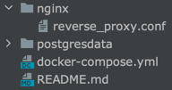
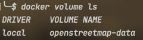

# OSM Server

## Предварительный этап для tile server:

Необходимо выгрузить образ командой:

`docker pull overv/openstreetmap-tile-server`

Далее необходимо загрузить в текущую директорию osm.pbf файл, который содержит данные о регионе, как пример – файл с данными о территории поволжья из geofabrik.de:

`wget https://download.geofabrik.de/russia/volga-fed-district-latest.osm.pbf`

Теперь нужно создать так называемый `volume`, который будет впоследствии хранить в себе данные для tile server, назовем его `openstreetmap-data`:

`docker volume create openstreetmap-data`

Теперь, собственно, заполним `volume` данными:

`time docker run -v <абсолютный путь до текущей директории>/volga-fed-district-latest.osm.pbf:/data.osm.pbf -v openstreetmap-data:/var/lib/postgresql/12/main overv/openstreetmap-tile-server import`

`<абсолютный путь до текущей директории>` можно получить командой pwd, обращаю внимание что относительный путь по типу `./volga-fed-district-latest.osm.pbf` работать не будет.

Данный шаг выполняется довольно долго, после завершения кладем запущенный контейнер, если он не положился сам (желательно удаляем его насовсем, так как он более не понадобится) и приступаем к следующему разделу.

## Предварительный этап для nominatim server

Выгружаем образ следующей командой:

`docker pull mediagis/nominatim`

Инициализируем БД при помощи того же osm.pbf файла и следующей команды:

`docker run -t -v <абсолютный путь до текущей директории>:/data mediagis/nominatim sh /app/init.sh /data/volga-fed-district-latest.osm.pbf postgresdata 4`

4 – количество потоков, которые будут задействованы при инициализации. Так как процесс довольно трудоемкий и выполняется намного дольше, чем самый долгий процесс в предыдущем разделе, то советую задействовать их как можно больше и пойти пить чай.

После того как процесс будет завершен, в текущей директории должна будет появиться папка `postgresdata`, которая содержит в себе файлы БД, необходимые для nominatim.

Теперь можно переходить к следующему разделу.

## Запуск

Теперь, когда все готово, директория проекта должна выглядеть примерно следующим образом:

Также должен существовать глобальный `volume` по названием `openstreetmap-data`:

На данный момент можно запустить оба сервиса при помощи команды `docker-compose up`

После запуска сервис `nominatim` будет доступен по маршруту `localhost:5000/nominatim`, а сервис тайлов по маршруту `localhost:5000/tiles`.

Данный факт можно проверить, перейдя по следующим маршрутам:

`http://localhost:5000/nominatim/reverse?format=json&lat=53.53051320304867&lon=49.30114746093751`

`http://localhost:5000/tiles/tile/0/0/0.png`

Порт 5000 можно поменять на какой угодно в файле `docker-compose.yml`.

Дополнительная информация, а также инструкция по актуализации сервисов находится в следующих репозиториях:

Nominatim:

https://github.com/mediagis/nominatim-docker/tree/master/3.5

Tile server:

https://github.com/Overv/openstreetmap-tile-server

